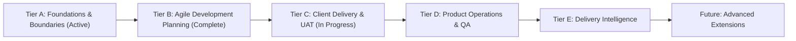

<div align="center">

# 🚀 KS-PMT (Kashvira Infotech - Project & Product Management Tool)

### *Enterprise Project & Product Management for Multi-Branch IT Teams and Clients*

[](https://opensource.org/licenses/MIT)
[](https://nestjs.com/)
[](https://vitejs.dev/)
[-02569B?logo=flutter&logoColor=white)](https://flutter.dev/)
[](https://www.postgresql.org/)
[](https://aws.amazon.com/s3/)
[](https://tailwindcss.com/)

---

**KS-PMT** is a centralized, self-hosted project and product management platform designed for IT software companies operating across **multiple branches and geographical locations**. It provides a single operational ecosystem supporting both **commercial software products** (licensing, AMC, feature releases) and **custom client software development services** (fixed-cost/T&M contracts, milestones, worklogs).

</div>

---

## 📑 Table of Contents

- [Architectural Overview](#-architectural-overview)
- [What KS-PMT Does](#-what-ks-pmt-does)
- [Current Implementation Status (Completed Modules)](#-current-implementation-status-completed-modules)
- [Comprehensive Feature Roadmap (Planned Scope)](#-comprehensive-feature-roadmap-planned-scope)
- [Core Documentation Index](#-core-documentation-index)
- [Technology Stack](#-technology-stack)
- [Directory Structure](#-directory-structure)
- [Quick Start & Installation Guide](#-quick-start--installation-guide)
  - [Prerequisites](#prerequisites)
  - [Step 1: Database Setup (Static SQL Scripts)](#step-1-database-setup-static-sql-scripts)
  - [Step 2: Backend REST API Setup (`server/`)](#step-2-backend-rest-api-setup-server)
  - [Step 3: Web Dashboard Setup (`web/`)](#step-3-web-dashboard-setup-web)
  - [Step 4: Mobile App Setup (`mobile/`)](#step-4-mobile-app-setup-mobile)
- [Default Super Admin Credentials](#-default-super-admin-credentials)
- [Community, Feedback & Support](#-community-feedback--support)

---

## 🏛 Architectural Overview

```
                               +---------------------------+
                               |      End Users & Apps     |
                               +-------------+-------------+
                                             |
                    +------------------------+------------------------+
                    |                                                 |
        [Modern Web Application]                             [Mobile Application]
        (React 19 + Vite + Tailwind)                         (Flutter Android & iOS)
                    |                                                 |
                    +------------------------+------------------------+
                                             | HTTPS (REST API)
                                             v
                             +-------------------------------+
                             |    Nginx Reverse Proxy / SSL  |
                             +---------------+---------------+
                                             |
                                             v
                             +-------------------------------+
                             |     NestJS Backend API        |
                             |    (Modular REST Server)      |
                             +---+---------------+-------+---+
                                 |               |       |
                +----------------+               |       +----------------+
                |                                |                        |
                v                                v                        v
    +-----------------------+        +-----------------------+   +-------------------+
    | PostgreSQL 15+ (DB)   |        | AWS S3 Cloud Storage  |   | Firebase Cloud    |
    | - Multi-branch RBAC   |        | - Pre-signed PUT/GET  |   | Messaging (FCM)   |
    | - Central Audit Log   |        | - Zero server storage |   | - Push Alerts     |
    | - Workflows & Tasks   |        | - Encrypted at rest   |   +-------------------+
    +-----------------------+        +-----------------------+
```

---

## 💡 What KS-PMT Does

Most off-the-shelf tools force organizations to choose between developer task tracking (like Jira) and client services/commercial operations. **KS-PMT unifies both** for multi-location IT enterprises:

1. **Dual Business Model Support**: Simultaneously manages **custom client development contracts** (milestones, budgets, billable hours) and **proprietary commercial software products** (customer licenses, version roadmaps, AMC entitlements).
2. **Multi-Branch Hierarchy with Granular RBAC**: Full organizational structure supporting head offices, development centers, and regional offices. Granular permission engine with **branch-level** and **user-level overrides** (e.g., allow a developer to see contract budgets without promoting them to Project Manager).
3. **End-to-End Client Delivery Lifecycle**: Structured pipeline from initial client request, requirement sign-off, change-request quotations, sprint development, QA verification, to formal client UAT acceptance.
4. **Secure Cloud-Native Architecture**: Direct AWS S3 pre-signed upload/download pipeline ensuring files never touch the API server disk, immutable audit trails, and strict PostgreSQL relational schema constraints.

---

## ✅ Current Implementation Status (Completed Modules)

The core foundational architecture, enterprise planning engine, and operational modules are implemented and available for development testing:

| Module / Area | Status | Implemented Capabilities |
| :--- | :---: | :--- |
| **Organizational Hierarchy & Masters** | ✅ Implemented | Multiple branches with GPS coordinates & geofencing radius, corporate departments, designations with ranking hierarchy, employee master. |
| **Authentication & Dynamic RBAC** | ✅ Implemented | Dual login (Email + Password with bcrypt & Mobile + OTP mock verification), JWT access & refresh tokens, dynamic roles/permissions, branch & user permission overrides. |
| **Clients, Projects & Products** | ✅ Implemented | CRM-lite client/prospect directory, Project commercials (Fixed-cost vs T&M, budgets), Proprietary products, licensing terms, AMC renewal dates, team allocations. |
| **Working Calendars & Capacity (`FND-001`)** | ✅ Implemented | Configurable working shifts, corporate public holidays, calendar assignments, employee leave requests/approvals, and dynamic effective working capacity calculation (`calculateWorkingCapacity`). |
| **Task Management Engine** | ✅ Implemented | Dynamic task types, customizable workflow statuses, multi-assignees, parent-child subtasks, rule-based & least-loaded auto-assignment, priority/severity flags. |
| **Jira-Style Task Experience** | ✅ Implemented | Inline quick-create modal, slide-over task drawer, full-page task view, Markdown descriptions, typed custom values, revision conflict detection. |
| **Work Hierarchy, Sprints & Milestones (`PLAN-001`)** | ✅ Implemented | 4-level hierarchy (`Initiative` → `Epic` → `Task/Story/Bug` → `Subtask`), independent sprints and product/project milestones, backlog ranking, sprint commitment and rollover tracking, scope-change ledger with baseline snapshots. |
| **Dependencies, Blockers & Defect Templates (`PLAN-002`)** | ✅ Implemented | Finish-to-Start & Blocks/Blocked-by links with cycle prevention; Blocker Radar tracking active episodes, root-causes, and non-overlapping blocked duration; structured defect templates (steps, actual vs expected, environment, workaround, severity vs priority, resolution classifications). |
| **Saved Views, Inline Editing & Bulk Actions (`PLAN-003`)** | ✅ Implemented | Personal and team saved views, scope-based sharing (Personal, Team, Project, Global), system presets, inline grid cell editing, permission-aware bulk updates with optimistic concurrency / revision checks & partial failure reporting, Attention Workspaces. |
| **Weekly Timesheets & Persistent Global Timer (`TIME-001`)** | ✅ Implemented | Monday-to-Sunday weekly effort matrix, calendar expected hours integration with missing hours warnings, cross-project reviewer portion routing with self-approval prevention & rejection resubmission, database-backed persistent global timer across tabs/devices invariant to browser blur with task-switch auto-logging. |
| **Delivery Teams & Software Components (`PLAN-004`)** | ✅ Implemented | Independent delivery teams, effective-dated member rosters with capacity allocations, software components catalog, architecture dependency maps, and authorized work/defect/tech debt drill-downs. |
| **Work Handoff Tracking & Queues (`FLOW-001`)** | ✅ Implemented | Cross-role handoffs (BA → Dev → Review → QA → UAT), inbound ("Waiting for Me") & outbound queues, dual metric tracking (elapsed wall-clock vs business calendar duration), separate acknowledgment vs work start, rework/redirect successor chains, and aggregate queue analytics without individual blame. |
| **Workflow Schemes & Transition Gates (`CONFIG-001`)** | ✅ Implemented | Visual workflow scheme editor, versioned project & product overrides, transition gate rules (roles, required fields, release association, resolution classification, manual gates), graph reachability validation, active task remapping on publish, and unified server-side gate enforcement across single, drawer, inline, and bulk updates. |
| **Customer Portal & Intake Triage (`CLIENT-001` & `CLIENT-002`)** | ✅ Implemented | Invitation-only contact activation, RBAC separation (`CLIENT_USER`, `CLIENT_ADMIN`, `CLIENT_APPROVER`), scoped project grants, private ticket intake (bugs, support, change requests) with customer impact assessment, separate internal severity/priority triage, 1-click delivery task conversion, customer-safe status mapping, internal vs public clarification stream, and complete zero-leak cross-client data isolation. |
| **Requirements & Acceptance Traceability (`CLIENT-003`)** | ✅ Implemented | Versioned requirement specifications, scope boundaries, measurable acceptance criteria, immutable frozen baselines, delivery task linking, QA verification evidence, client sign-off workflows, coverage gap radar, and end-to-end traceability matrix. |
| **Scope & Change-Request Approval (`CLIENT-004`)** | ✅ Implemented | Formal change request quotations with effort (hours), commercial price/currency, schedule delay impact, accountable PM, and milestone linkage; material revision engine ($N+1$) with re-approval guarantees; attributable client approver decisions with audit timestamps; zero-leak internal notes; and approved change delivery task mapping. |
| **Client UAT & Milestone Sign-Off (`CLIENT-005`)** | ✅ Implemented | Versioned UAT acceptance packages with milestone linkage, build/commit metadata, test environment URL; independent tri-state verification (`Developer-Done` &rarr; `QA-Verified` &rarr; `Client-Accepted`); transparent known issues disclosure; attributable client approver sign-off (`APPROVE` / `REQUEST_CHANGES` / `REJECT`); material revision ($N+1$) re-approval enforcement; client-installed version registry; and customer portal verification without internal QA leakage. |
| **Web Views & Grid Experience** | ✅ Implemented | Interactive drag-and-drop Kanban board, shared TanStack DataGrid (faceted search, multi-column sorting, nested grouping, CSV/Print export), light/dark theme. |
| **AWS S3 Cloud Storage** | ✅ Implemented | Direct-to-S3 pre-signed PUT/GET URL generation for attachments, screenshots, and logs; zero binary storage on backend API server. |
| **Audit Trails & Activity Logs** | ✅ Implemented | Central audit log capturing entity mutations, old/new diffs, timestamps, user IDs, IP addresses, and user-agent tags. |
| **Cross-Platform Mobile (Flutter)** | 🟡 Foundation Built | Flutter 3.x codebase (Android & iOS), 5-tab navigation, secure token storage, automatic 401 token refresh queue, GPS geofencing branch check, camera integration. |

> *Note: Live provider credentials (production SMS gateway, AWS SES email, FCM push) and native store builds undergo formal environment acceptance as detailed in the [Tasks Checklist](docs/tasks-checklist.md).*

---

## 🗺️ Comprehensive Feature Roadmap (Planned Scope)

All roadmap items are categorized by strategic delivery increment. Each feature has a stable specification ID linked directly to the [Software Requirements Specification (SRS)](docs/requirements.md) and [Master Implementation Plan](docs/plan.md):



### 📌 Tier A: Foundations & Boundary Governance
- **`FND-001` Shared Planning Foundations** [✅ Core Implemented]: Configurable employee and contractor working calendars (working days, shifts, holidays, approved leave); effective capacity calculation; multi-tenant audience isolation (internal, client-shared, product-community); reproducible baseline and event-history tracking.

### 📌 Tier B: Agile Development & Daily Planning
- **`PLAN-001` Work Hierarchy, Backlog & Sprints** [✅ Implemented]: 4-level hierarchy (`Initiative` → `Epic/Feature` → `Story/Task/Bug` → `Subtask`); ranked project and product backlogs; sprints independent of releases; sprint goals, team sizing, and commitment/rollover tracking; scope-change ledger.
- **`PLAN-002` Task Dependencies & Blocker Management** [✅ Implemented]: Finish-to-Start and Blocks/Blocked-by links with circular dependency prevention; Blocker Radar tracking blocker owners, reasons, next actions, and elapsed blocker episodes; rich bug reproduction templates.
- **`PLAN-003` Advanced Views, Inline Editing & Bulk Actions** [✅ Implemented]: Personal and team saved views, favorites, inline cell editing in listing grids, permission-aware bulk status/assignee updates with conflict handling, server-side query optimizations, and "My Work" focused queues.
- **`TIME-001` Effort & Timesheets with Durable Timer** [✅ Implemented]: Schedule-aware weekly timesheets with cross-project approval and audited amendments; durable single active timer in database across browser tabs that does not stop on window blur; task-switching auto-logging.
- **`PLAN-004` Delivery Teams & Software Component Ownership** [✅ Implemented]: Dedicated delivery teams and component architecture catalogs; tracking defects and technical debt per component without expanding project access boundaries.
- **`FLOW-001` Work Handoff Tracking** [✅ Implemented]: Explicit handoffs between roles/teams (e.g., Dev → QA), tracking acknowledgment time, work-start time, return/redirect history, unbroken successor chaining, and queue waiting time analysis.
- **`CONFIG-001` Project-Specific Workflow Overrides & Gates** [✅ Implemented]: Visual workflow editor allowing versioned project/product workflow progression, mandatory custom fields per status transition, role-restricted gates, release & resolution requirements, graph reachability validation, active task remapping on publish, and unified API/inline/bulk enforcement.

### 📌 Tier C: Client Delivery & Collaboration
- **`CLIENT-001` & `CLIENT-002` Customer Portal & Intake Triage** [✅ Implemented]: Invited client contacts with role-scoped project access; invitation token redemption and credential management; private bug, support, and change-request intake; separation of customer impact/urgency from internal technical priority; customer-facing sanitized status mapping; zero-leak internal clarifications vs public customer replies; 1-click delivery task conversion and duplicate linking; strict cross-client data isolation.
- **`CLIENT-003` Requirements & Acceptance Traceability** [✅ Implemented]: Versioned functional requirements, measurable acceptance criteria directly linked to delivery tasks and manual QA evidence; immutable frozen baselines with amendment workflows; client sign-off governance; coverage gap radar and end-to-end traceability matrix.
- **`CLIENT-004` Scope & Change-Request Approval** [✅ Implemented]: Scope change quotations with effort, cost, and timeline impacts; formal authorized client approval of specific revisions with re-approval triggers for material modifications; separate internal review notes; attributable decision audit trail; and approved change delivery task mapping.
- **`CLIENT-005` Client UAT & Milestone Sign-Off** [✅ Implemented]: Versioned UAT acceptance packages with milestone linkage and release notes; tri-state verification (`Developer-Done` &rarr; `QA-Verified` &rarr; `Client-Accepted`); transparent known issues disclosure; formal client approver sign-off (`APPROVE` / `REQUEST_CHANGES` / `REJECT`); material revision ($N+1$) re-approval enforcement; customer portal test verification without internal QA note leakage; and explicit client-installed version registry.
- **`CLIENT-006` Client Progress Updates & Reporting** [✅ Implemented]: PM-curated periodic progress reports, health indicators (`ON_TRACK`, `NEEDS_ATTENTION`, `AT_RISK`), milestone schedule forecasts (committed date vs indicative forecast date), decisions/actions required from client with SLA deadlines, zero-leakage redaction of internal notes/commercials, immutable revision snapshots on publish, markdown digest generation for cross-channel distribution, and customer portal view.
- **`DEL-001` Risks, Assumptions & Versioned Client Decisions**: Project RAID log; structured decision register recording context, evaluated alternatives, client approval timestamps, and supersession history.

### 📌 Tier D: Product Operations & Repeatable Quality
- **`PROD-001` Product Discovery, Voting & Roadmaps**: Moderated customer feedback ideas, one-vote-per-organization voting, duplicate merging, RICE prioritization scoring, and public/private Now / Next / Later roadmaps with changelog links.
- **`PROD-002` Product Goals & Outcome Reviews**: Measurable product goals (baselines vs targets) and dated post-release outcome evaluation reviews.
- **`QA-001` Manual Test Cases & Release Readiness**: Reusable manual test cases, test execution runs, test evidence attachments, affected/fix version tracking, and release-readiness checklists.
- **`QA-002` Environment-Specific Issue Verification**: Environment-specific reproduction and verification evidence across staging, production, and client on-premise installations.
- **`COLLAB-001` & `COLLAB-002` Knowledge Base, Templates & Recurring Work**: Versioned specification documents and FAQs; rich Markdown comments with S3 attachments; reusable project and task templates; recurring automated task generator.
- **`COLLAB-003` Granular Notification Preferences & Digests**: Watchers/followers on work items, channel preferences, daily/weekly digests, quiet hours, and authorization verification at dispatch.
- **`COLLAB-004` "What Changed?" Activity Summaries**: Permission-aware change summaries showing all scope additions, removals, blockers, and status changes since last login, sprint baseline, or custom date.
- **`COMM-001` Retainer & AMC Entitlements**: Tracking included monthly/annual hours, approved work consumption, rollover rules, overage authorization, and client statement generation.
- **`DATA-001` Data Import & Portable Exports**: CSV onboarding wizard with column mapping, dry-run validation, row-level error reporting, duplicate-safe retries, and sanitized portable exports.

### 📌 Tier E: Delivery Intelligence & Analytics
- **`ANALYTICS-001` Contractual SLA & Risk Alerts**: Contract response and resolution SLA timers, calendar-aware pauses, escalation paths, and rule-based deadline warnings.
- **`ANALYTICS-002` Flow Analytics & Bottlenecks**: WIP limits, status aging, active vs waiting time heatmaps, cumulative flow diagrams, lead/cycle time distributions, and rework tracking.
- **`ANALYTICS-003` Workload & Capacity Insights**: Calendar-aware capacity forecasting, explainable skill-matching suggestions, and split co-assignee demand analysis.
- **`ANALYTICS-004` Project Financials, Variance & Reconciliation**: Baseline effort variance, budget consumption alerts, independent remaining estimates, burn curves, and currency-aware gross margin reporting.

### 🔮 Future Extensions
- **`LATER-001` Advanced Scheduling & Scenario Previews**: SS/FF/SF dependencies, lag time, critical path analysis, and what-if capacity scenario modeling.
- **`LATER-002` Assisted Drafting & Gap Analysis**: Source-linked requirement gap detection, draft WBS generation, and release summary drafting with human-in-the-loop review.
- **`API-001` Scoped Outbound Webhooks**: Signed event webhooks with delivery history, retries, and destination security checks.
- **`ADMIN-001` Configuration Packages & Setup Wizard**: Versioned exportable configuration packages for rapid multi-instance or new-branch provisioning.

---

## 📚 Core Documentation Index

To maintain clarity and prevent document proliferation, KS-PMT maintains **5 authoritative documents** in the [`docs/`](docs/) directory:

| Document | Purpose | Key Contents |
| :--- | :--- | :--- |
| **[Requirements (SRS)](docs/requirements.md)** | Functional & Business Specification | Complete SRS, business actors, NFRs, data standards, and detailed specifications for all feature IDs (`FND`, `PLAN`, `CLIENT`, etc.). |
| **[Master Implementation Plan](docs/plan.md)** | Delivery Strategy & Roadmap Phases | Architecture design, phases 1–9, roadmap delivery increments A through E, dependencies, and review gates. |
| **[Tasks & Verification Checklist](docs/tasks-checklist.md)** | Progress Tracking & Verification | Granular checklist of implemented features, pending provider verifications, and planned roadmap items. |
| **[Technology Stack & Architecture](docs/tech-stack.md)** | Technical Design & Components | Architectural diagrams, tech rationales, directory structure, REST conventions, TanStack DataGrid component, and domain models. |
| **[Production Deployment Guide](docs/deployment-guide.md)** | Operations & Hosting Manual | Server setup, Nginx reverse proxy, PM2 process management, SSL certificates, AWS S3 bucket configuration, and PostgreSQL backups. |

*(For end-to-end user journeys and sample API payloads, see the companion [Operational Walkthrough Guide](docs/walkthrough.md)).*

---

## 🛠 Technology Stack

| Layer | Technologies | Description |
| :--- | :--- | :--- |
| **Backend Framework** | [NestJS 10](https://nestjs.com/) (Node.js 20+, TypeScript) | Modular, enterprise REST API with class-validator, Passport JWT, and Swagger documentation. |
| **Database** | [PostgreSQL 15+](https://www.postgresql.org/) | Relational database using `uuid-ossp`, `pgcrypto`, PL/pgSQL triggers, and denormalized SQL reporting views. |
| **Database Access** | Native `pg.Pool` Connection Pooling | Direct, optimized SQL queries without ORM abstraction overhead, enforcing static SQL script guidelines. |
| **Cloud Storage** | [AWS S3](https://aws.amazon.com/s3/) (`@aws-sdk/client-s3`) | Pre-signed PUT/GET URLs for direct client uploads/downloads; zero media files stored on the server. |
| **Security & Auth** | JWT, Passport, Bcrypt, Helmet | Dual login (Email + Password and Mobile + OTP), rate-limiting, and multi-branch RBAC. |
| **Web Frontend** | [React 19](https://react.dev/), [Vite](https://vitejs.dev/) | High-performance SPA with [Tailwind CSS v4](https://tailwindcss.com/), [TanStack Table v8](https://tanstack.com/table/v8), and [Lucide React](https://lucide.dev/). |
| **Mobile App** | [Flutter 3.x](https://flutter.dev/) (Dart) | Cross-platform Android & iOS app with Dio interceptor queues, Geolocator GPS, and native Camera capture. |
| **Testing** | [Jest](https://jestjs.io/), `ts-jest` | Comprehensive unit and integration test suites for backend services, guards, and controllers. |

---

## 📂 Directory Structure

```
ks-pmt/
├── dbscripts/                        # Static PostgreSQL DDL/DML scripts (Strict blank-database policy)
│   ├── install.psql                  # Run all object scripts and seeds with psql
│   ├── build-install.mjs             # Generate install.sql for pgAdmin (no DB connection)
│   ├── install.sql                   # Generated, Git-ignored bundle; regenerate after SQL changes
│   ├── tables/                       # tables.sql (Current blank-database canonical schema)
│   ├── views/                        # vw_project_financial_summary.sql, etc.
│   ├── functions/                    # fn_calculate_task_effort.sql, fn_set_updated_at.sql, etc.
│   ├── triggers/                     # trg_tasks_updated_at.sql, trg_tasks_audit.sql, etc.
│   ├── indexes/                      # indexes.sql (Optimized composite indexes)
│   └── inserts/                      # inserts.sql (Roles, permissions, Super Admin seed)
│
├── server/                           # NestJS REST API Backend
│   ├── src/
│   │   ├── common/                   # Guards, interceptors, filters, decorators
│   │   ├── database/                 # DatabaseService connection pool
│   │   └── modules/                  # Auth, RBAC, Branches, Users, Tasks, TimeLogs,
│   │                                 # Attachments (S3), Notifications, AuditLogs, Projects
│   └── test/                         # Unit and integration test suites
│
├── web/                              # Modern Responsive Web Application (React + Vite + Tailwind)
│   ├── src/
│   │   ├── api/                      # Axios client with auto-refresh & typed endpoints
│   │   ├── context/                  # AuthContext (RBAC evaluator) & ThemeContext
│   │   ├── components/               # Bento Dashboard, Kanban Board, Task Drawer, DataGrid, Modals
│   │   └── types/                    # TypeScript interfaces
│   └── vite.config.ts
│
├── mobile/                           # Cross-Platform Mobile Application (Flutter Android & iOS)
│   ├── android/                      # Native AndroidManifest with GPS, Camera, S3 permissions
│   ├── ios/                          # iOS Info.plist with Location, Camera, Photo Library strings
│   ├── lib/
│   │   ├── core/                     # Constants, Theme, Dio client with 401 token refresh queue
│   │   ├── data/                     # Models, repositories, S3 media uploader, Geolocator service
│   │   └── presentation/             # AuthProvider, TaskProvider, 5-tab screens
│   └── pubspec.yaml
│
└── docs/                             # Authoritative System Documentation (5 Core Documents)
    ├── requirements.md               # Software Requirements Specification (SRS) & Roadmap IDs
    ├── plan.md                       # Master Implementation Plan & Delivery Increments
    ├── tasks-checklist.md            # Task Progress & Verification Checklist
    ├── tech-stack.md                 # Technical Architecture, DataGrid, and Domain Design
    ├── deployment-guide.md           # Production Deployment & Hosting Manual
    └── walkthrough.md                # System Walkthrough & Operational Guide
```

---

## 🚀 Quick Start & Installation Guide

### Prerequisites

- **Node.js**: `v20.x` or `v22.x` (LTS)
- **PostgreSQL**: `v15+` running on port `5432`
- **AWS S3 Bucket**: Configured for pre-signed uploads
- **Flutter SDK**: `v3.x` (for mobile development)

---

### Step 1: Database Setup (Static SQL Scripts)

> [!IMPORTANT]
> **This project is under development.** After every major change, the developer / DBA will run and test it against a blank database. Maintain schema changes directly in the canonical `CREATE` definitions instead of adding `ALTER`, `DROP`, `UPDATE`, or `DELETE` migration statements. Required seed inserts and application logic inside SQL functions/procedures are retained. Incremental migrations will be used once the project is declared live. See [database script guidelines](AGENTS.md#1-database-script-generation--management-rules).

**1. Prepare a blank database.** The developer / DBA performs these steps manually. Install the `psql` client for the terminal option, and ensure the database user can create objects in `public` and install the `uuid-ossp` and `pgcrypto` extensions.

Create a new database in pgAdmin, or use the PostgreSQL `createdb` command:

```bash
createdb -U postgres kspmt_db
```

Use the same database name in the installation command and `DB_NAME` in `server/.env`. The commands below assume `kspmt_db`; change it if your blank database has a different name.

**2. Choose one installation option.** Run commands from the project root.

**Option A — Terminal:** run all separate object scripts and seed data with one command:

```bash
psql -X -v ON_ERROR_STOP=1 -U postgres -d kspmt_db -f dbscripts/install.psql
```

The installer runs tables/extensions, functions, triggers, views, indexes, and seed data in dependency order within one transaction, stopping on errors.

**Option B — pgAdmin Query Tool:** generate the combined plain SQL file first (Node.js 20+; generation does not connect to a database or execute SQL):

```bash
node dbscripts/build-install.mjs
```

On Windows, you can instead double-click **`build-db-install.bat`** in the project root. It generates the same file and keeps the window open to display the result. From a terminal, use `build-db-install.bat --no-pause` to exit immediately after generation.

Open **Query Tool** on the blank database, open `dbscripts/install.sql`, clear any text selection, and choose **Execute script** to run the entire file. If an error leaves the transaction aborted, run `ROLLBACK;` before retrying the corrected script.

**3. Keep the source files separate.** Edit object definitions in their dedicated folders. Add new object files to `dbscripts/install.psql` in dependency order, and regenerate the Git-ignored `install.sql` after every SQL change.

Both options include the seed data and [default Super Admin account](#-default-super-admin-credentials); do not run the seed file again separately. See [database installation instructions](dbscripts/README.md) for more details.

---

### Step 2: Backend REST API Setup (`server/`)

1. **Navigate to the server directory**:
   ```bash
   cd server
   ```

2. **Install dependencies**:
   ```bash
   npm install
   ```

3. **Configure Environment Variables**:
   Copy the example environment file:
   ```bash
   cp .env.example .env
   ```
   Configure your database and AWS credentials in `.env`:
   ```env
   PORT=5000
   DB_HOST=localhost
   DB_PORT=5432
   DB_USER=postgres
   DB_PASSWORD=your_postgres_password
   DB_NAME=kspmt_db

   JWT_ACCESS_SECRET=super_secret_access_key_change_in_production_32_chars
   JWT_ACCESS_EXPIRATION=900s
   JWT_REFRESH_SECRET=super_secret_refresh_key_change_in_production_32_chars
   JWT_REFRESH_EXPIRATION=7d

   AWS_REGION=ap-south-1
   AWS_ACCESS_KEY_ID=your_aws_access_key
   AWS_SECRET_ACCESS_KEY=your_aws_secret_key
   AWS_S3_BUCKET_NAME=your_s3_bucket_name
   ```

4. **Run Unit Tests**:
   ```bash
   npm test
   ```

5. **Start Development Server**:
   ```bash
   npm run start:dev
   ```
   The REST API will be accessible at `http://localhost:5000/api/v1`.
   Interactive Swagger documentation will be available at `http://localhost:5000/api/docs`.

---

### Step 3: Web Dashboard Setup (`web/`)

1. **Navigate to the web directory**:
   ```bash
   cd web
   ```

2. **Install dependencies**:
   ```bash
   npm install
   ```

3. **Start Vite Development Server**:
   ```bash
   npm run dev
   ```
   Open your browser and navigate to `http://localhost:3000`.

4. **Build for Production**:
   ```bash
   npm run build
   # Production build output ready in web/dist/
   ```

---

### Step 4: Mobile App Setup (`mobile/`)

1. **Navigate to the mobile directory**:
   ```bash
   cd mobile
   ```

2. **Install Flutter packages**:
   ```bash
   flutter pub get
   ```

3. **Run on Connected Device or Emulator**:
   ```bash
   # Launch on connected Android device/emulator
   flutter run -d android

   # Launch on iOS Simulator (macOS only)
   flutter run -d ios
   ```

---

## 🔑 Default Super Admin Credentials

The database installer includes `dbscripts/inserts/inserts.sql` and provisions the root Super Admin account:

| Parameter | Default Value | Notes |
| :--- | :--- | :--- |
| **Employee Code** | `EMP-0001` | System Administrator |
| **Email Address** | `admin@kashvirainfotech.com` | Primary login email |
| **Mobile Number** | `+919999900000` | For OTP authentication |
| **Password** | `Admin@123456` | *Change immediately upon first login* |
| **OTP (development mode)** | Dynamic verification code | Request generated code in mock mode; live SMS delivery requires SMS gateway configuration |

---

## 💬 Community, Feedback & Support

This project is **100% open source** released under the [MIT License](https://opensource.org/licenses/MIT). We built **KS-PMT** with passion to help a software development or product company manage its projects across all its locations and branches, with full control over its deployment and data.

### 📬 Get in Touch
- **Contact Email**: `kashvirainfotech@gmail.com`

### 🌟 Let Us Know If You Are Using KS-PMT!
If you or your organization are using this project, **please drop us a short email at `kashvirainfotech@gmail.com`**.  
Hearing how KS-PMT helps your team gives us immense confidence, motivation, and a boost to keep adding more and more advanced enterprise features!

### 💡 Stopped Using KS-PMT? Help Us Improve!
If you tested, installed, or previously used KS-PMT but decided to stop using it, **we would genuinely love to know why**.  
Please email us with your honest feedback, pain points, or missing features. We welcome all feedback with open arms and will use it to continuously improve the tool for the entire developer community.

### 🤝 Feedback, Suggestions & Bug Reports
Feedback, feature suggestions, and bug reports are warmly welcomed! Please open an issue to share your ideas or report a problem, or email us at `kashvirainfotech@gmail.com`.

---

<div align="center">
  <sub>Engineered with ❤️ by <b>Kashvira Infotech</b></sub>
</div>
