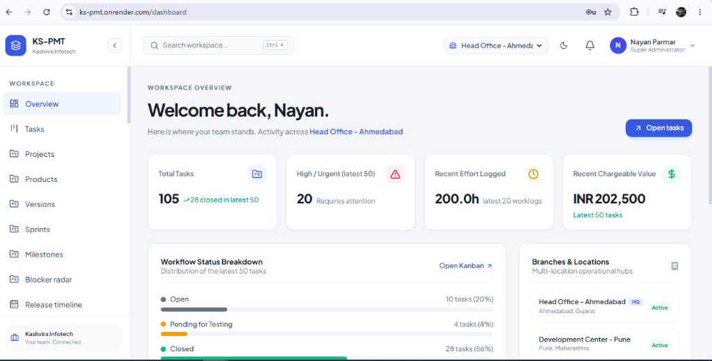
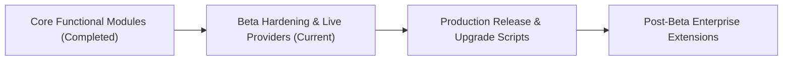

<div align="center">

# 🚀 KS-PMT (Kashvira Infotech - Project & Product Management Tool)

### *Enterprise Project & Product Management for Multi-Branch IT Teams and Clients*

[](https://github.com/kashvirainfotech/ks-pmt)
[](https://opensource.org/licenses/MIT)
[](https://nestjs.com/)
[](https://vitejs.dev/)
[-02569B?logo=flutter&logoColor=white)](https://flutter.dev/)
[](https://www.postgresql.org/)
[](https://aws.amazon.com/s3/)
[](https://tailwindcss.com/)
[](https://ks-pmt.onrender.com/)

---

**KS-PMT** is a centralized, self-hosted project and product management platform designed for IT software companies operating across **multiple branches and geographical locations**. It provides a single operational ecosystem supporting both **commercial software products** (licensing, AMC, feature releases) and **custom client software development services** (fixed-cost/T&M contracts, milestones, worklogs).

</div>

---

> [!IMPORTANT]
> ### ⚠️ Beta Version Notice — Database Installation & Upgrade Policy
>
> **KS-PMT is currently in Beta version (active development).**
> - **Blank Database / Fresh Install Only**: All database scripts located in [`dbscripts/`](dbscripts/) are strictly intended for a **blank database / fresh installation** and **not for upgrade purposes**. During this phase, database schemas are maintained directly in their canonical `CREATE` definitions without intermediate migration history.
> - **Future Upgrades & Migration Scripts**: Once we complete development of all planned points and thorough testing, we will establish a stable baseline. From that point onward, all future changes, feature additions, and bug fixes will be provided with formal **upgrade and migration scripts** to preserve existing database installations.

---

## 🌐 Live Demo & Preview

Explore and interact with a live, hosted deployment of **KS-PMT**:

- 🔗 **Live Demo URL**: [https://ks-pmt.onrender.com/](https://ks-pmt.onrender.com/)
- 🔑 **Demo Login Credentials**:
  - **Email**: `admin@kashvirainfotech.com`
  - **Password**: `Admin@123456`
  - *(Pre-seeded with multi-branch workspaces, Kanban boards, client delivery workflows, UAT packages, and release gates)*

<p align="center">
  
</p>

---

## 📑 Table of Contents

- [⚠️ Beta Version & Database Notice](#️-beta-version-notice--database-installation--upgrade-policy)
- [Live Demo & Preview](#-live-demo--preview)
- [Architectural Overview](#-architectural-overview)
- [What KS-PMT Does](#-what-ks-pmt-does)
- [Completed Features & Functional Modules](#-completed-features--functional-modules)
- [Planned Roadmap & Future Scope](#-planned-roadmap--future-scope)
- [Core Documentation Index](#-core-documentation-index)
- [Technology Stack](#-technology-stack)
- [Directory Structure](#-directory-structure)
- [Quick Start & Installation Guide](#-quick-start--installation-guide)
  - [Prerequisites](#prerequisites)
  - [Step 1: Database Setup (Static SQL Scripts)](#step-1-database-setup-static-sql-scripts)
  - [Step 2: Backend REST API Setup (`server/`)](#step-2-backend-rest-api-setup-server)
  - [Step 3: Web Dashboard Setup (`web/`)](#step-3-web-dashboard-setup-web)
  - [Step 4: Mobile App Setup (`mobile/`)](#step-4-mobile-app-setup-mobile)
- [Default Super Admin Credentials](#-default-super-admin-credentials)
- [Community, Feedback & Support](#-community-feedback--support)
- [About Kashvira Infotech & Project Policy](#about-kashvira-infotech--project-policy)

---

## 🏛 Architectural Overview

```
                               +---------------------------+
                               |      End Users & Apps     |
                               +-------------+-------------+
                                             |
                    +------------------------+------------------------+
                    |                                                 |
        [Modern Web Application]                             [Mobile Application]
        (React 19 + Vite + Tailwind)                         (Flutter Android & iOS)
                    |                                                 |
                    +------------------------+------------------------+
                                             | HTTPS (REST API)
                                             v
                             +-------------------------------+
                             |    Nginx Reverse Proxy / SSL  |
                             +---------------+---------------+
                                             |
                                             v
                             +-------------------------------+
                             |     NestJS Backend API        |
                             |    (Modular REST Server)      |
                             +---+---------------+-------+---+
                                 |               |       |
                +----------------+               |       +----------------+
                |                                |                        |
                v                                v                        v
    +-----------------------+        +-----------------------+   +-------------------+
    | PostgreSQL 15+ (DB)   |        | AWS S3 Cloud Storage  |   | Firebase Cloud    |
    | - Multi-branch RBAC   |        | - Pre-signed PUT/GET  |   | Messaging (FCM)   |
    | - Central Audit Log   |        | - Zero server storage |   | - Push Alerts     |
    | - Workflows & Tasks   |        | - Encrypted at rest   |   +-------------------+
    +-----------------------+        +-----------------------+
```

---

## 💡 What KS-PMT Does

Most off-the-shelf tools force organizations to choose between developer task tracking (like Jira) and client services/commercial operations. **KS-PMT unifies both** for multi-location IT enterprises:

1. **Dual Business Model Support**: Simultaneously manages **custom client development contracts** (milestones, budgets, billable hours) and **proprietary commercial software products** (customer licenses, version roadmaps, AMC entitlements).
2. **Multi-Branch Hierarchy with Granular RBAC**: Full organizational structure supporting head offices, development centers, and regional offices. Granular permission engine with **branch-level** and **user-level overrides** (e.g., allow a developer to see contract budgets without promoting them to Project Manager).
3. **End-to-End Client Delivery Lifecycle**: Structured pipeline from initial client request, requirement sign-off, change-request quotations, sprint development, QA verification, to formal client UAT acceptance.
4. **Secure Cloud-Native Architecture**: Direct AWS S3 pre-signed upload/download pipeline ensuring files never touch the API server disk, immutable audit trails, and strict PostgreSQL relational schema constraints.

---

## ✅ Completed Features & Functional Modules

The entire functional scope spanning Tiers A through E and Advanced Extensions has been implemented and is actively available in the codebase:

### 🏢 1. Enterprise Foundations, Multi-Branch & Security
- **Organizational Hierarchy & Masters**: Multi-branch support with GPS coordinates & geofencing radius, corporate departments, designations with ranking hierarchy, and employee master.
- **Authentication & Dynamic RBAC**: Dual login (Email + Password with bcrypt & Mobile + OTP mock verification), JWT access & refresh tokens, dynamic roles/permissions, and granular branch/user-level permission overrides.
- **`FND-001` Working Calendars & Capacity Planning**: Configurable employee and contractor working calendars (shifts, corporate holidays, approved leave); effective working capacity calculation (`calculateWorkingCapacity`).
- **AWS S3 Cloud Storage**: Direct-to-S3 pre-signed PUT/GET URL generation for attachments, screenshots, and logs; zero binary storage on backend API server.
- **Immutable Audit Trails**: Central audit log capturing entity mutations, old/new diffs, timestamps, user IDs, IP addresses, and user-agent tags.

### ⚡ 2. Agile Planning, Work Breakdown & Daily Operations
- **Jira-Style Task Experience**: Inline quick-create modal, slide-over task drawer, full-page task view, Markdown descriptions, typed custom values, and revision conflict detection with TanStack DataGrid.
- **`PLAN-001` Work Hierarchy, Backlog & Sprints**: 4-level hierarchy (`Initiative` → `Epic` → `Task/Story/Bug` → `Subtask`), independent sprints and product/project milestones, backlog ranking, sprint commitment and rollover tracking, and scope-change ledger with baseline snapshots.
- **`PLAN-002` Dependencies, Blocker Radar & Defect Templates**: Finish-to-Start & Blocks/Blocked-by links with circular dependency prevention; Blocker Radar tracking active blocker episodes, root causes, and non-overlapping duration; structured defect reproduction templates.
- **`PLAN-003` Saved Views, Inline Grid Editing & Bulk Actions**: Personal and team saved views, scope-based sharing (Personal, Team, Project, Global), system presets, inline grid cell editing, and permission-aware bulk updates with optimistic concurrency checks and partial failure reporting.
- **`TIME-001` Weekly Timesheets & Persistent Global Timer**: Monday-to-Sunday weekly effort matrix with calendar expected hours integration and missing hours warnings; cross-project reviewer portion routing with self-approval prevention; database-backed persistent global timer across tabs/devices invariant to browser blur with task-switch auto-logging.
- **`PLAN-004` Delivery Teams & Software Components**: Independent delivery teams, effective-dated member rosters with capacity allocations, software components catalog, architecture dependency maps, and authorized work/defect/tech debt drill-downs.
- **`FLOW-001` Work Handoff Tracking & Queues**: Cross-role handoffs (BA → Dev → Review → QA → UAT), inbound ("Waiting for Me") & outbound queues, dual metric tracking (elapsed wall-clock vs business calendar duration), separate acknowledgment vs work start, rework/redirect successor chains, and aggregate queue analytics.
- **`CONFIG-001` Workflow Schemes & Transition Gates**: Visual workflow scheme editor, versioned project & product overrides, transition gate rules (roles, required fields, release association, resolution classification, manual gates), graph reachability validation, active task remapping on publish, and unified server-side gate enforcement.

### 🤝 3. Client Delivery Lifecycle, Customer Portal & Milestone Sign-Off
- **`CLIENT-001` & `CLIENT-002` Customer Portal & Intake Triage**: Invitation-only contact activation, RBAC separation (`CLIENT_USER`, `CLIENT_ADMIN`, `CLIENT_APPROVER`), scoped project grants, private ticket intake (bugs, support, change requests) with customer impact assessment, separate internal severity/priority triage, 1-click delivery task conversion, customer-safe status mapping, internal vs public clarification stream, and complete zero-leak cross-client data isolation.
- **`CLIENT-003` Requirements Specification & Traceability Matrix**: Versioned functional requirements, scope boundaries, measurable acceptance criteria, immutable frozen baselines with amendment workflows, delivery task linking, QA verification evidence, client sign-off workflows, coverage gap radar, and end-to-end traceability matrix.
- **`CLIENT-004` Scope & Change-Request Approval**: Formal change request quotations with effort (hours), commercial price/currency, schedule delay impact, accountable PM, and milestone linkage; material revision engine ($N+1$) with re-approval guarantees; attributable client approver decisions with audit timestamps; zero-leak internal notes; and approved change delivery task mapping.
- **`CLIENT-005` Client UAT & Milestone Sign-Off**: Versioned UAT acceptance packages with milestone linkage, build/commit metadata, test environment URL; independent tri-state verification (`Developer-Done` &rarr; `QA-Verified` &rarr; `Client-Accepted`); transparent known issues disclosure; attributable client approver sign-off (`APPROVE` / `REQUEST_CHANGES` / `REJECT`); material revision ($N+1$) re-approval enforcement; client-installed version registry; and customer portal verification without internal QA leakage.
- **`CLIENT-006` Progress Reports & Status Briefings**: PM-curated client progress reports with executive narrative, overall health status (`ON_TRACK`, `NEEDS_ATTENTION`, `AT_RISK`), milestone target vs committed dates, decisions needed, material revisions, and formatted Markdown digest export.
- **`DEL-001` RAID Items & Client Action Requests**: Project risks with matrix score (Likelihood × Impact), assumptions with validation dates, architecture/project decisions (ADR format with alternatives considered and supersession chains), and client action requests with approver sign-offs and zero internal risk leakage.

### 🎯 4. Product Operations, Repeatable Quality & Collaboration
- **`PROD-001` Product Discovery, Voting & Roadmaps**: Product discovery backlog with objective RICE prioritization (Reach, Impact, Confidence, Effort, Strategic Fit); PM curation and moderation with sanitized public summaries; atomic one-vote-per-organization voting system (`UNIQUE (idea_id, client_id)`) with independent follows; duplicate merging with atomic vote deduplication; and authenticated Now / Next / Later public roadmaps with indicative targets and approved changelog release notes.
- **`QA-001` Manual Test Cases, Test Runs & Release Gates**: Reusable test suites and manual test cases with step-by-step instructions, expected results, priority/severity, and requirement criteria linkage; version/milestone-gated test runs with pass/fail/blocked execution tracking; 1-click defect logging directly from test run items; release readiness checklists with mandatory sign-off gates (`QA_TESTING`, `SECURITY`, `CLIENT_UAT`, `PERFORMANCE`, `DATA_MIGRATION`, `DOCUMENTATION`); and QA requirement traceability matrix with pass rate calculation.
- **`COLLAB-001` Knowledge Base, ADRs & Runbooks**: Versioned documentation system for architecture decision records (ADRs), specifications, and operational runbooks; multi-level audience boundaries (`INTERNAL_ONLY`, `CLIENT_SHARED`, `PUBLIC_COMMUNITY`); immutable revision snapshots with visual text diff comparison (`unified` and `split` views); bi-directional task/milestone/criterion entity linking; and revision-pinned AWS S3 attachment metadata management.
- **`COLLAB-002` Project & Task Templates with Idempotent Recurrence**: Reusable project blueprints (Client Onboarding, Fixed-Price Delivery, Retainers) and task template library with structured checklists; relative date calculation engine (`anchorStartDate + start_offset_days` and `duration_days`); idempotent recurring schedules (`DAILY`, `WEEKLY`, `BIWEEKLY`, `MONTHLY`, `QUARTERLY`, `ANNUALLY`) with unique scheduled date deduplication (`UNIQUE (rule_id, scheduled_date)`) preventing duplicate work generation; and strict isolation boundaries with zero implicit copying of client permissions, past worklogs, or confidential attachments.
- **`PROD-002` Product Goals & Outcome Reviews**: Strategic and operational product goals scoped to software products with measurable baseline, target, and current progress metrics; dated post-release outcome evaluation reviews linking released versions and discovery ideas; qualitative feedback, adoption telemetry, and customer evidence tracking; and reconciliation of approved customer allowances without double consumption.
- **`QA-002` QA Environments & Retest Matrix**: Scoped test environment definitions (Internal QA, Staging, Client UAT, Client Production, On-Premise Air-Gapped) with context metadata; environment-and-version-specific issue observations/retests; strict enforcement that internal QA verification does not automatically resolve client environments or older client versions; and cross-client confidentiality boundaries.
- **`COLLAB-003` Notification Preferences, Watchers & Digests**: Independent work item watchers across tasks, knowledge docs, ideas, and CRs; granular channel toggles (In-App, Email, Push); digest modes (`INSTANT`, `DAILY`, `WEEKLY`); quiet hours windowing with urgent bypass; 8-category event preferences; and reliable deduplicated delivery queue with authorization re-check engine.
- **`COLLAB-004` "What Changed?" Activity Summaries & Baselines**: Deterministic baseline diffing and activity stream since last login, 24h/7d/30d windows, or frozen scope baselines; source-linked event counts vs distinct item counts; missing-history disclosure; and client-safe executive summaries without AI.
- **`COMM-001` Retainer & AMC Entitlements**: Commercial contracts & recurring periods management; included, approved, remaining, and rolled-over allowance accounting; strict single-consumption ledger (rejecting worklog consumes nothing, approval retries never consume twice); agreed rollover engine (`NO_ROLLOVER`, `FULL_ROLLOVER`, `CAPPED_ROLLOVER`); CLIENT-004 linked overage authorizations; and transparent client entitlement statements without internal margin leaks.
- **`DATA-001` Data Import & Portable Exports**: Guided CSV onboarding wizard with field mapping, zero-write dry-run validation with reference checks, idempotent retry engine, protected-field security boundaries, and CWE-1236 sanitized portable exports.

### 📊 5. Delivery Intelligence, Analytics & Financial Management
- **`ANALYTICS-001` Contractual SLA & Risk Alerts**: Deterministic policy matching by client, project, type, priority, and severity; calendar-based vs elapsed duration tracking; strict customer visibility rules for response SLA; terminal customer-facing status enforcement for resolution; pause outward deadline shifting; CR-linked extensions; and rule-based non-duplicating risk alerts with auto-clearing triggers.
- **`ANALYTICS-002` Flow Analytics & Bottlenecks**: Configurable maximum WIP limits (stage, user, team, project) with soft warnings, hard guards, and audited expedited override exceptions; distinct work item counting with blocked task overlay; operational aging radar (status tenure, primary owner tenure, blocked age, queue waiting age); active vs waiting flow time partitioning; lead & cycle time percentile distributions (p50, p85, p95); stage dwell time heatmap; and daily rebuildable Cumulative Flow Diagrams (CFD).
- **`ANALYTICS-003` Delivery, Workload & Capacity Insights**: Non-additive capacity views (calendar working hours, reserved overhead, net available capacity, committed allocation %, active task demand); split co-assignee effort shares summing to 100% (or $1/N$ default); non-task capacity reservations (support rotations, mentoring, training, recurring meetings); explainable skill matching with transparent scoring breakdown; and team-level estimation reliability metrics (EAI, estimation bias direction, OTD %, FTR %) strictly without individual rankings.
- **`ANALYTICS-004` Project Financials, Variance & Reconciliation**: Baseline effort variance, budget consumption thresholds with alert triggers, independent remaining estimates (EAC), weekly cumulative burn curves, effective-dated rate snapshots, multi-currency conversion, and confidential direct delivery margin reporting with N/A handling.

### 🔧 6. Platform Extensibility, Automation & Configuration Toolkit
- **`LATER-001` Advanced Scheduling, Critical Path & Scenario Previews**: Critical Path Method (CPM), forward/backward pass network analysis, total/free float slack calculation, SS/FF/SF dependencies with lead/lag duration, What-If schedule scenario simulations with explicit live application, and calibrated composite project health scoring across 5 weighted dimensions.
- **`API-001` Scoped Outbound Webhooks & Event Integrations**: Allowlisted PMT event distribution, HMAC-SHA256 signature verification (`X-PMT-Signature`), graceful secret key rotation, destination SSRF blocking (private RFC 1918 subnets & cloud metadata endpoints), bounded exponential backoff retries, delivery audit ledger, and 1-click manual replay.
- **`ADMIN-001` Enterprise Setup Wizard & Configuration Packages**: 6-step single-company initialization wizard, constrained corporate branding profile, versioned portable package bundles (JSON export/import), dry-run diff preview with conflict resolution policies (`SKIP` vs `OVERWRITE`), zero-leak artifact boundaries, and execution audit logging.
- **`LATER-002` Source-Linked Drafting & Human-Reviewed Summaries**: Deterministic 4-phase WBS generator (Architecture, Backend, Frontend, QA), Given-When-Then acceptance criteria derivation, audience-bounded release notes compiler (CLIENT_SAFE redacting dev refactors), automated coverage gap audit (`RULE-GAP-TESTING`, `RULE-GAP-ACCEPTANCE`), Jaccard token duplicate detection (`RULE-DUP-TASKS`), and human review ledger with 1-click instantiation into live entities.

### 📱 7. Cross-Platform Mobile Application (Flutter)
- **Cross-Platform Mobile (Android & iOS)**: Complete Flutter 3.x mobile codebase, 5-tab workspace navigation (Dashboard, Tasks, Timesheets, Approvals, Profile), secure token storage with automatic 401 token refresh queue, GPS geofencing branch validation, and native camera integration for work evidence.

---

## 🗺️ Planned Roadmap & Future Scope

With all foundational, agile, client delivery, quality, intelligence, and integration modules implemented in the codebase, our roadmap now focuses on production hardening, formal environment acceptance, and post-beta enterprise capabilities:



### 🎯 Current Focus: Beta Hardening & Live Provider Acceptance
1. **Production SMS Gateway Credentials**: Validate live transactional SMS gateway credentials (replacing the development OTP mock) with carrier delivery reporting and retry bounds.
2. **Production AWS SES Email Verification**: Complete production AWS SES domain validation, DKIM signing, and bounce/complaint handling for transactional email notifications.
3. **Production Firebase Cloud Messaging (FCM)**: Configure production service account keys, APNs certificates, and FCM topics for mobile push notifications.
4. **Mobile Store Builds & Distribution**: Configure release keystores, ProGuard rules, iOS provisioning profiles, and automated pipeline builds for Google Play Store and Apple App Store distribution.
5. **High-Concurrency Load & Stress Testing**: Run stress test suites simulating concurrent multi-branch timesheet approvals, rapid Kanban card reordering, and bulk status updates.

### 🔮 Post-Beta Enterprise Extensions (Deferred Scope)
As defined in Section 11.6 of the project specification, the following enterprise capabilities are deferred to post-beta phases:
- **Multi-Tenant Partner & Hosting Management**: Centralized management portal for IT service providers hosting and maintaining multiple isolated PMT instances across different client companies.
- **Sandboxed Plugin & Extension Architecture**: Sandboxed plugin runtime allowing third-party developers to contribute custom web widgets, report exporters, and custom integration connectors.
- **In-Product Automated Backup & Disaster Recovery**: Web-based administration console for scheduling automated PostgreSQL dumps, off-site S3 backup replication, and 1-click restore verification.
- **Universal Visual Automation Designer**: Graphical workflow builder for composing custom cross-entity automation triggers (e.g., "When task moves to QA, automatically notify client lead and assign specific test run").
- **Dedicated Monthly Invoicing & Billing Lifecycle**: Formal billing cycles with downloadable PDF client invoices, taxation line items, and payment reconciliation ledgers.

### 🚫 Explicit Scope Boundaries & Non-Goals
To maintain architectural focus, high performance, and strict data security, the following remain explicitly out of scope:
- **No Git / DevOps Repository Hosting**: KS-PMT does not host Git repositories or run CI/CD build pipelines; it connects with development platforms via scoped signed webhooks (`API-001`) and release metadata.
- **No Full Accounting / Payroll Ledger**: KS-PMT tracks project delivery effort, billable rates, and contract margins; it interfaces with external accounting software rather than replacing specialized ERP/accounting systems.
- **No Unrestricted Public Self-Registration**: KS-PMT enforces private corporate security; all user accounts and client contacts are created via administrative invitation and explicit branch/project assignment.

---

## 📚 Core Documentation Index

To maintain clarity and prevent document proliferation, KS-PMT maintains **5 authoritative documents** in the [`docs/`](docs/) directory:

| Document | Purpose | Key Contents |
| :--- | :--- | :--- |
| **[Requirements (SRS)](docs/requirements.md)** | Functional & Business Specification | Complete SRS, business actors, NFRs, data standards, and detailed specifications for all feature IDs (`FND`, `PLAN`, `CLIENT`, etc.). |
| **[Master Implementation Plan](docs/plan.md)** | Delivery Strategy & Roadmap Phases | Architecture design, phases 1–9, roadmap delivery increments A through E, dependencies, and review gates. |
| **[Tasks & Verification Checklist](docs/tasks-checklist.md)** | Progress Tracking & Verification | Granular checklist of implemented features, pending provider verifications, and planned roadmap items. |
| **[Technology Stack & Architecture](docs/tech-stack.md)** | Technical Design & Components | Architectural diagrams, tech rationales, directory structure, REST conventions, TanStack DataGrid component, and domain models. |
| **[Production Deployment Guide](docs/deployment-guide.md)** | Operations & Hosting Manual | Server setup, Nginx reverse proxy, PM2 process management, SSL certificates, AWS S3 bucket configuration, and PostgreSQL backups. |

*(For end-to-end user journeys and sample API payloads, see the companion [Operational Walkthrough Guide](docs/walkthrough.md)).*

---

## 🛠 Technology Stack

| Layer | Technologies | Description |
| :--- | :--- | :--- |
| **Backend Framework** | [NestJS 10](https://nestjs.com/) (Node.js 20+, TypeScript) | Modular, enterprise REST API with class-validator, Passport JWT, and Swagger documentation. |
| **Database** | [PostgreSQL 15+](https://www.postgresql.org/) | Relational database using `uuid-ossp`, `pgcrypto`, PL/pgSQL triggers, and denormalized SQL reporting views. |
| **Database Access** | Native `pg.Pool` Connection Pooling | Direct, optimized SQL queries without ORM abstraction overhead, enforcing static SQL script guidelines. |
| **Cloud Storage** | [AWS S3](https://aws.amazon.com/s3/) (`@aws-sdk/client-s3`) | Pre-signed PUT/GET URLs for direct client uploads/downloads; zero media files stored on the server. |
| **Security & Auth** | JWT, Passport, Bcrypt, Helmet | Dual login (Email + Password and Mobile + OTP), rate-limiting, and multi-branch RBAC. |
| **Web Frontend** | [React 19](https://react.dev/), [Vite](https://vitejs.dev/) | High-performance SPA with [Tailwind CSS v4](https://tailwindcss.com/), [TanStack Table v8](https://tanstack.com/table/v8), and [Lucide React](https://lucide.dev/). |
| **Mobile App** | [Flutter 3.x](https://flutter.dev/) (Dart) | Cross-platform Android & iOS app with Dio interceptor queues, Geolocator GPS, and native Camera capture. |
| **Testing** | [Jest](https://jestjs.io/), `ts-jest` | Comprehensive unit and integration test suites for backend services, guards, and controllers. |

---

## 📂 Directory Structure

```
ks-pmt/
├── dbscripts/                        # Static PostgreSQL DDL/DML scripts (Strict blank-database policy)
│   ├── install.psql                  # Run all object scripts and seeds with psql
│   ├── build-install.mjs             # Generate install.sql for pgAdmin (no DB connection)
│   ├── install.sql                   # Generated, Git-ignored bundle; regenerate after SQL changes
│   ├── tables/                       # tables.sql (Current blank-database canonical schema)
│   ├── views/                        # vw_project_financial_summary.sql, etc.
│   ├── functions/                    # fn_calculate_task_effort.sql, fn_set_updated_at.sql, etc.
│   ├── triggers/                     # trg_tasks_updated_at.sql, trg_tasks_audit.sql, etc.
│   ├── indexes/                      # indexes.sql (Optimized composite indexes)
│   └── inserts/                      # inserts.sql (Roles, permissions, Super Admin seed)
│
├── server/                           # NestJS REST API Backend
│   ├── src/
│   │   ├── common/                   # Guards, interceptors, filters, decorators
│   │   ├── database/                 # DatabaseService connection pool
│   │   └── modules/                  # Auth, RBAC, Branches, Users, Tasks, TimeLogs,
│   │                                 # Attachments (S3), Notifications, AuditLogs, Projects
│   └── test/                         # Unit and integration test suites
│
├── web/                              # Modern Responsive Web Application (React + Vite + Tailwind)
│   ├── src/
│   │   ├── api/                      # Axios client with auto-refresh & typed endpoints
│   │   ├── context/                  # AuthContext (RBAC evaluator) & ThemeContext
│   │   ├── components/               # Bento Dashboard, Kanban Board, Task Drawer, DataGrid, Modals
│   │   └── types/                    # TypeScript interfaces
│   └── vite.config.ts
│
├── mobile/                           # Cross-Platform Mobile Application (Flutter Android & iOS)
│   ├── android/                      # Native AndroidManifest with GPS, Camera, S3 permissions
│   ├── ios/                          # iOS Info.plist with Location, Camera, Photo Library strings
│   ├── lib/
│   │   ├── core/                     # Constants, Theme, Dio client with 401 token refresh queue
│   │   ├── data/                     # Models, repositories, S3 media uploader, Geolocator service
│   │   └── presentation/             # AuthProvider, TaskProvider, 5-tab screens
│   └── pubspec.yaml
│
└── docs/                             # Authoritative System Documentation (5 Core Documents)
    ├── requirements.md               # Software Requirements Specification (SRS) & Roadmap IDs
    ├── plan.md                       # Master Implementation Plan & Delivery Increments
    ├── tasks-checklist.md            # Task Progress & Verification Checklist
    ├── tech-stack.md                 # Technical Architecture, DataGrid, and Domain Design
    ├── deployment-guide.md           # Production Deployment & Hosting Manual
    └── walkthrough.md                # System Walkthrough & Operational Guide
```

---

## 🚀 Quick Start & Installation Guide

### Prerequisites

- **Node.js**: `v20.x` or `v22.x` (LTS)
- **PostgreSQL**: `v15+` running on port `5432`
- **AWS S3 Bucket**: Configured for pre-signed uploads
- **Flutter SDK**: `v3.x` (for mobile development)

---

### Step 1: Database Setup (Static SQL Scripts)

> [!IMPORTANT]
> **This project is under development.** After every major change, the developer / DBA will run and test it against a blank database. Maintain schema changes directly in the canonical `CREATE` definitions instead of adding `ALTER`, `DROP`, `UPDATE`, or `DELETE` migration statements. Required seed inserts and application logic inside SQL functions/procedures are retained. Incremental migrations will be used once the project is declared live. See [database script guidelines](AGENTS.md#1-database-script-generation--management-rules).

**1. Prepare a blank database.** The developer / DBA performs these steps manually. Install the `psql` client for the terminal option, and ensure the database user can create objects in `public` and install the `uuid-ossp` and `pgcrypto` extensions.

Create a new database in pgAdmin, or use the PostgreSQL `createdb` command:

```bash
createdb -U postgres kspmt_db
```

Use the same database name in the installation command and `DB_NAME` in `server/.env`. The commands below assume `kspmt_db`; change it if your blank database has a different name.

**2. Choose one installation option.** Run commands from the project root.

**Option A — Terminal:** run all separate object scripts and seed data with one command:

```bash
psql -X -v ON_ERROR_STOP=1 -U postgres -d kspmt_db -f dbscripts/install.psql
```

The installer runs tables/extensions, functions, triggers, views, indexes, and seed data in dependency order within one transaction, stopping on errors.

**Option B — pgAdmin Query Tool:** generate the combined plain SQL file first (Node.js 20+; generation does not connect to a database or execute SQL):

```bash
node dbscripts/build-install.mjs
```

On Windows, you can instead double-click **`build-db-install.bat`** in the project root. It generates the same file and keeps the window open to display the result. From a terminal, use `build-db-install.bat --no-pause` to exit immediately after generation.

Open **Query Tool** on the blank database, open `dbscripts/install.sql`, clear any text selection, and choose **Execute script** to run the entire file. If an error leaves the transaction aborted, run `ROLLBACK;` before retrying the corrected script.

**3. Keep the source files separate.** Edit object definitions in their dedicated folders. Add new object files to `dbscripts/install.psql` in dependency order, and regenerate the Git-ignored `install.sql` after every SQL change.

Both options include the seed data and [default Super Admin account](#-default-super-admin-credentials); do not run the seed file again separately. See [database installation instructions](dbscripts/README.md) for more details.

---

### Step 2: Backend REST API Setup (`server/`)

1. **Navigate to the server directory**:
   ```bash
   cd server
   ```

2. **Install dependencies**:
   ```bash
   npm install
   ```

3. **Configure Environment Variables**:
   Copy the example environment file:
   ```bash
   cp .env.example .env
   ```
   Configure your database and AWS credentials in `.env`:
   ```env
   PORT=5000
   DB_HOST=localhost
   DB_PORT=5432
   DB_USER=postgres
   DB_PASSWORD=your_postgres_password
   DB_NAME=kspmt_db

   JWT_ACCESS_SECRET=super_secret_access_key_change_in_production_32_chars
   JWT_ACCESS_EXPIRATION=900s
   JWT_REFRESH_SECRET=super_secret_refresh_key_change_in_production_32_chars
   JWT_REFRESH_EXPIRATION=7d

   AWS_REGION=ap-south-1
   AWS_ACCESS_KEY_ID=your_aws_access_key
   AWS_SECRET_ACCESS_KEY=your_aws_secret_key
   AWS_S3_BUCKET_NAME=your_s3_bucket_name
   ```

4. **Run Unit Tests**:
   ```bash
   npm test
   ```

5. **Start Development Server**:
   ```bash
   npm run start:dev
   ```
   The REST API will be accessible at `http://localhost:5000/api/v1`.
   Interactive Swagger documentation will be available at `http://localhost:5000/api/docs`.

---

### Step 3: Web Dashboard Setup (`web/`)

1. **Navigate to the web directory**:
   ```bash
   cd web
   ```

2. **Install dependencies**:
   ```bash
   npm install
   ```

3. **Start Vite Development Server**:
   ```bash
   npm run dev
   ```
   Open your browser and navigate to `http://localhost:3000`.

4. **Build for Production**:
   ```bash
   npm run build
   # Production build output ready in web/dist/
   ```

---

### Step 4: Mobile App Setup (`mobile/`)

1. **Navigate to the mobile directory**:
   ```bash
   cd mobile
   ```

2. **Install Flutter packages**:
   ```bash
   flutter pub get
   ```

3. **Run on Connected Device or Emulator**:
   ```bash
   # Launch on connected Android device/emulator
   flutter run -d android

   # Launch on iOS Simulator (macOS only)
   flutter run -d ios
   ```

---

## 🔑 Default Super Admin Credentials

The database installer includes `dbscripts/inserts/inserts.sql` and provisions the root Super Admin account:

| Parameter | Default Value | Notes |
| :--- | :--- | :--- |
| **Employee Code** | `EMP-0001` | System Administrator |
| **Email Address** | `admin@kashvirainfotech.com` | Primary login email |
| **Mobile Number** | `+919999900000` | For OTP authentication |
| **Password** | `Admin@123456` | *Change immediately upon first login* |
| **OTP (development mode)** | Dynamic verification code | Request generated code in mock mode; live SMS delivery requires SMS gateway configuration |

---

## 💬 Community, Feedback & Support

This project is **100% open source** released under the [MIT License](https://opensource.org/licenses/MIT). We built **KS-PMT** with passion to help a software development or product company manage its projects across all its locations and branches, with full control over its deployment and data.

### 📬 Get in Touch
- **Contact Email**: `kashvirainfotech@gmail.com`

### 🌟 Let Us Know If You Are Using KS-PMT!
If you or your organization are using this project, **please drop us a short email at `kashvirainfotech@gmail.com`**.  
Hearing how KS-PMT helps your team encourages us and helps us understand how the project is being used.

### 💡 Stopped Using KS-PMT? Help Us Improve!
If you tested, installed, or previously used KS-PMT but decided to stop using it, **we would genuinely love to know why**.  
Please email us with your feedback, challenges, or missing features. We appreciate these insights and will consider them as we work toward the planned scope, subject to our team's capacity.

### 🤝 Feedback, Suggestions & Bug Reports
Feedback, feature suggestions, and bug reports are warmly welcomed! Please open an issue to share your ideas or report a problem, or email us at `kashvirainfotech@gmail.com`.

---

## About Kashvira Infotech & Project Policy

### Our Company & Why We Built KS-PMT

Kashvira Infotech is a small IT startup providing software solutions for manufacturing companies, warehouse management systems (WMS), transportation management systems (TMS), custom software tailored to client requirements, and web and mobile application development services.

After evaluating paid and free tools available in the market, we chose to develop KS-PMT for our internal project and product management needs, including task and ticket tracking. This approach helps us manage costs by avoiding recurring SaaS subscription fees while retaining full control over our workflows, deployment, and data.

### Professional Services

We offer installation, setup, implementation, training, support, customization, and hosting services to clients who wish to use KS-PMT for their project and product management needs.

For each client's customization engagement, we create a separate private GitHub repository based on this repository and share access with that client. We develop and deliver the agreed custom requirements in that private repository, maintaining a dedicated codebase for the client.

### Repository Usage & Future Changes

> [!IMPORTANT]
> **Please treat this repository as a starting point for your own implementation. Future changes in this public repository, particularly database scripts, are intended for fresh installations only and should not be treated as upgrade or migration scripts for existing installations.**

You are welcome to fork this repository and adapt it to your requirements under the MIT License. If you would like assistance with customization, please contact us at [kashvirainfotech@gmail.com](mailto:kashvirainfotech@gmail.com).

### Contributions & Maintenance Expectations

**We do not accept pull requests for this repository.** As a small team, we are focusing our available resources on completing the planned open-source scope. Ongoing community development and pull request review would require dedicated staffing that we are unable to commit to. Please refrain from submitting pull requests; you are welcome to maintain enhancements in your own fork.

Feedback, suggestions, and bug reports remain welcome through issues or email. However, we cannot commit to continuous feature development, ongoing maintenance, or a response or resolution timeline for the public repository.

---

<div align="center">
  <sub>Engineered with ❤️ by <b>Kashvira Infotech</b></sub>
</div>
