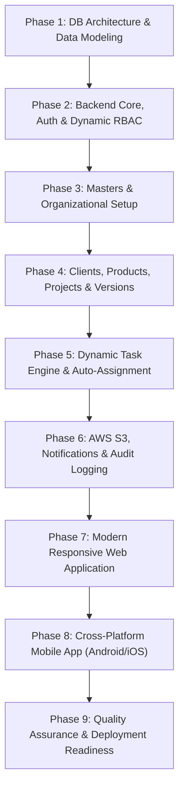

# Master Implementation Plan
## KS-PMT: Multi-Branch Project & Product Management System

---

## 1. Project Implementation Phases

---

## 2. Phase-by-Phase Roadmap & Milestones

### Phase 1: Database Architecture & Data Modeling
- **Goals**: Design and generate the complete PostgreSQL relational schema in strict compliance with project guidelines.
- **Key Deliverables**:
  - `dbscripts/tables/tables.sql`: Core schema with all audit columns (`created_by`, `created_at`, `updated_by`, `updated_at`) and `is_active` flags on all masters.
  - `dbscripts/indexes/indexes.sql`: Performance indexes on foreign keys, tenant/branch IDs, task statuses, and date ranges.
  - `dbscripts/functions/`: Helper functions for updated timestamps, auto-assignment calculation, and audit trail generation.
  - `dbscripts/triggers/`: Automatic `updated_at` modification triggers and activity log interceptors.
  - `dbscripts/views/`: Denormalized reporting views (task summary by project/product, user workload, monthly billable hours).
  - `dbscripts/inserts/inserts.sql`: Master seed data (default roles, permissions, department templates, designation levels, standard task types, and workflow statuses).
- **Review Gate**: Developer manual verification and execution of SQL scripts on the development database.

### Phase 2: Backend Core, Authentication & Dynamic RBAC
- **Goals**: Establish the modular NestJS REST API server, security middleware, dual authentication, and granular permission engine.
- **Key Deliverables**:
  - NestJS modular skeleton with global filters, interceptors, and DTO validation pipes.
  - Dual Authentication system:
    - Email + Password login (Argon2id hashing).
    - Mobile + OTP login (CSPRNG 6-digit generation, Redis storage, SMS dispatch integration).
  - JWT Access Token & Refresh Token lifecycle with secure token rotation.
  - Dynamic RBAC Engine:
    - Role and Permission check guards.
    - User-level permission override evaluation logic.
    - Branch-level permission override evaluation logic.

### Phase 3: Masters & Organizational Hierarchy
- **Goals**: Implement REST API endpoints for organizational management.
- **Key Deliverables**:
  - **Branches / Locations Module**: CRUD, geofence radius coordinates, multi-branch listing.
  - **Departments Module**: CRUD, HOD assignment, active/inactive toggles.
  - **Designations Module**: CRUD, hierarchy level ordering, department association.
  - **Users / Employees Module**: User creation (admin-only), branch assignment, profile management, status toggling.
  - **Dynamic Task Types & Workflows Module**: Configurable task types (Bug, New Development, etc.) and their permissible status transitions.

### Phase 4: Clients, Products, Projects & Versions
- **Goals**: Implement business entities and client commercial relationships.
- **Key Deliverables**:
  - **Clients & Prospects Module**: Leads and active clients, account managers, contact persons.
  - **Products Module**: Product master, license models, AMC fees, client-to-product mapping (licenses/subscriptions).
  - **Projects Module**: Custom development projects, client-to-project mapping, contract amounts, budget hours, team allocations.
  - **Versions & Releases Module**: Milestone and version planning for both products and projects with scheduled start/target release dates.

### Phase 5: Dynamic Task Engine, Time Tracking & Auto-Assignment
- **Goals**: Core task management capabilities, subtasks, worklogs, and intelligent auto-assignment.
- **Key Deliverables**:
  - **Tasks Module**:
    - Creation with dynamic type, title, rich description, priority, planned/actual dates, estimated hours.
    - Chargeable flag (`is_chargeable`) and charge amount calculation.
    - Multi-assignee support (linking multiple employees to a single task).
    - Hierarchical sub-tasks with progress roll-up.
  - **Task Status Progression Engine**: Dynamic state machine enforcing allowed status transitions based on task type.
  - **Auto-Assignment Matrix**:
    - Trigger rules on task creation and status transition.
    - Automatic routing based on department, designation, branch, or round-robin availability.
  - **Time Tracking / Effort Logging**:
    - Worklogs with hours spent, billable flag, and work summaries.
    - Weekly timesheet summaries and manager sign-off.
  - **Comments & Collaboration**:
    - Threaded task comments with `@mentions` and file attachments.

### Phase 6: Cloud Storage (AWS S3), Real-Time Notifications & Audit Trail
- **Goals**: Secure media storage, multi-channel notification engine, and system activity tracking.
- **Key Deliverables**:
  - **AWS S3 Integration**:
    - Pre-signed PUT URL generation for client uploads (tasks, comments, user avatars).
    - Pre-signed GET URL generation for authorized private file downloads.
    - File metadata database tracking (file name, MIME type, file size, S3 bucket/key).
  - **Notification Engine**:
    - In-app notification alerts with unread counter.
    - Firebase Cloud Messaging (FCM) integration for mobile push notifications.
    - Email dispatch service (AWS SES) with responsive templates.
  - **Comprehensive Activity Tracking**:
    - Global audit interceptor capturing entity changes, old/new diffs, IP addresses, user agents, and geolocation tags.

### Phase 7: Modern Responsive Web Application (React + Vite + Tailwind)
- **Goals**: Build an intuitive, high-performance web interface following modern UI trends.
- **Key Deliverables**:
  - Design system with Tailwind CSS and Shadcn UI (accessible, clean typography, dark/light theme).
  - Multi-Branch & Executive Bento-Grid Dashboards.
  - Interactive Task Views:
    - Kanban Board with drag-and-drop status transitions.
    - List View with advanced multi-filter (Branch, Project, Assignee, Priority, Status, Date).
    - Gantt / Timeline view for Version and Milestone schedules.
  - Task Detail Drawer / Modal with subtasks, multi-assignees, attachments preview, time-logging widget, and comment stream.
  - Administrative Management Screens for Masters, Users, Roles, and Permission Overrides.
  - Client & Project Financial Portals with budget vs. actual hours and billable metrics.
  - Fully mobile-responsive layout for tablets and smartphones.

### Phase 8: Cross-Platform Mobile Applications (Flutter - Android & iOS)
- **Goals**: Deploy native-quality mobile apps with hardware integration.
- **Key Deliverables**:
  - Dual login screen (Email/Password & Mobile/OTP with auto-read on Android).
  - Employee Dashboard showing My Tasks, Urgent Deadlines, and Quick Actions.
  - Camera & File Attachment Integration:
    - Direct capture of photos/documents, auto-compression, and direct-to-S3 upload.
  - Geolocation Access:
    - Location verification against branch geofence on check-in or field task assignment.
  - Mobile Time-Tracker:
    - One-tap start/pause/stop live timer for active tasks.
  - Push Notification integration (FCM) with deep-linking directly to the referenced task.
  - Offline task caching and sync capabilities.

### Phase 9: Testing, Security Hardening, API Docs & Delivery
- **Goals**: Comprehensive verification, documentation, and production readiness.
- **Key Deliverables**:
  - Unit and integration testing suites.
  - OWASP security vulnerability scan and penetration testing audit.
  - Complete Swagger / OpenAPI 3.0 specification published for external developers.
  - Developer Handover & Operations Guide.

---

## 3. Risk Assessment & Mitigation Strategies

| Risk Factor | Impact | Mitigation Strategy |
| :--- | :--- | :--- |
| **Complex Permission Overrides** | High | Implement deterministic hierarchical evaluation: `User Overrides` > `Branch Overrides` > `Role Base Permissions`. Cache compiled permission sets in Redis with instant invalidation on update. |
| **Direct S3 Upload Vulnerabilities** | Medium | Strictly validate file MIME types and size constraints before granting pre-signed upload URLs. Use private S3 buckets with IAM least privilege. |
| **Large Audit Log Data Growth** | Medium | Partition the `audit_logs` table by month/quarter in PostgreSQL. Implement automated archival policies for historical logs older than 12 months. |
| **Push Notification Latency** | Low | Implement asynchronous message queues (Redis / BullMQ) to offload notification delivery from the primary HTTP request-response cycle. |
