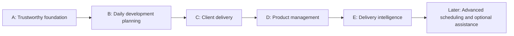

# Master Implementation Plan

## KS-PMT: Multi-Branch Project & Product Management System

---

## 1. Delivery Strategy

Updated: 2026-09-29 (IST). [Requirements](requirements.md) define behavior; [the checklist](tasks-checklist.md) records implementation and dated verification. This plan sets dependency order, not duration estimates or claims of completion.

Phases 1–9 below retain the original foundation scope as reference; their completion is governed by the checklist and newer evidence. Remaining native field capabilities do not block web/client delivery. Testing, accessibility, authorization and manual database acceptance are gates within every increment.

```mermaid
flowchart LR
    A["A: Trustworthy foundation"] --> B["B: Daily development planning"]
    B --> C["C: Client delivery"]
    C --> D["D: Product management"]
    D --> E["E: Delivery intelligence"]
    E --> L["Later: Advanced scheduling and optional assistance"]
```

Focus: development teams and clients managing custom projects and software products. Git integration, DevOps and CI/CD automation are excluded. Manual QA evidence, release planning and client acceptance remain in scope. Existing deployment guides describe operation of KS-PMT itself.

---

## 2. Phase-by-Phase Roadmap & Milestones

### Phase 1: Database Architecture & Data Modeling

- **Goals**: Design and generate the complete PostgreSQL relational schema in strict compliance with project guidelines.
- **Key Deliverables**:
  - `dbscripts/tables/tables.sql`: Core schema with all audit columns (`created_by`, `created_at`, `updated_by`, `updated_at`) and `is_active` flags on all masters.
  - `dbscripts/indexes/indexes.sql`: Performance indexes on foreign keys, client/project scope and branch IDs, task statuses, and date ranges.
  - `dbscripts/functions/`: Helper functions for updated timestamps, auto-assignment calculation, and audit trail generation.
  - `dbscripts/triggers/`: Automatic `updated_at` modification triggers and activity log interceptors.
  - `dbscripts/views/`: Denormalized reporting views (task summary by project/product, user workload, monthly billable hours).
  - `dbscripts/inserts/inserts.sql`: Master seed data (default roles, permissions, department templates, designation levels, standard task types, and workflow statuses).
- **Review Gate**: Developer manual verification and execution of SQL scripts on the development database.

### Phase 2: Backend Core, Authentication & Dynamic RBAC

- **Goals**: Establish the modular NestJS REST API server, security middleware, dual authentication, and granular permission engine.
- **Key Deliverables**:
  - NestJS modular skeleton with global filters, interceptors, and DTO validation pipes.
  - Dual Authentication system:
    - Email + Password login (current bcrypt implementation; hash-policy changes require explicit implementation).
    - Mobile + OTP login (CSPRNG 6-digit generation, Redis storage, SMS dispatch integration).
  - JWT Access Token & Refresh Token lifecycle with secure token rotation.
  - Dynamic RBAC Engine:
    - Role and Permission check guards.
    - User-level permission override evaluation logic.
    - Branch-level permission override evaluation logic.

### Phase 3: Masters & Organizational Hierarchy

- **Goals**: Implement REST API endpoints for organizational management.
- **Key Deliverables**:
  - **Branches / Locations Module**: CRUD, geofence radius coordinates, multi-branch listing.
  - **Departments Module**: CRUD, HOD assignment, active/inactive toggles.
  - **Designations Module**: CRUD, hierarchy level ordering, department association.
  - **Users / Employees Module**: User creation (admin-only), branch assignment, profile management, status toggling.
  - **Dynamic Task Types & Workflows Module**: Configurable task types (Bug, New Development, etc.) and their permissible status transitions.

### Phase 4: Clients, Products, Projects & Versions

- **Goals**: Implement business entities and client commercial relationships.
- **Key Deliverables**:
  - **Clients & Prospects Module**: Leads and active clients, account managers, contact persons.
  - **Products Module**: Product master, license models, AMC fees, client-to-product mapping (licenses/subscriptions).
  - **Projects Module**: Custom development projects, client-to-project mapping, contract amounts, budget hours, team allocations.
  - **Versions & Releases Module**: Milestone and version planning for both products and projects with scheduled start/target release dates.

### Phase 5: Dynamic Task Engine, Time Tracking & Auto-Assignment

- **Goals**: Core task management capabilities, subtasks, worklogs, and intelligent auto-assignment.
- **Key Deliverables**:
  - **Tasks Module**:
    - Creation with dynamic type, title, rich description, priority, planned/actual dates, estimated hours.
    - Chargeable flag (`is_chargeable`) and charge amount calculation.
    - Multi-assignee support (linking multiple employees to a single task).
    - Hierarchical sub-tasks with progress roll-up.
  - **Task Status Progression Engine**: Dynamic state machine enforcing allowed status transitions based on task type.
  - **Auto-Assignment Matrix**:
    - Trigger rules on task creation and status transition.
    - Automatic routing based on department, designation, branch, or least-loaded availability (legacy strategy code `ROUND_ROBIN`).
  - **Time Tracking / Effort Logging**:
    - Worklogs with hours spent, billable flag, and work summaries.
    - Weekly timesheet summaries and manager sign-off.
  - **Comments & Collaboration**:
    - Threaded task comments with `@mentions` and file attachments.

### Phase 6: Cloud Storage (AWS S3), Real-Time Notifications & Audit Trail

- **Goals**: Secure media storage, multi-channel notification engine, and system activity tracking.
- **Key Deliverables**:
  - **AWS S3 Integration**:
    - Pre-signed PUT URL generation for client uploads (tasks, comments, user avatars).
    - Pre-signed GET URL generation for authorized private file downloads.
    - File metadata database tracking (file name, MIME type, file size, S3 bucket/key).
  - **Notification Engine**:
    - In-app notification alerts with unread counter.
    - Firebase Cloud Messaging (FCM) integration for mobile push notifications.
    - Email dispatch service (AWS SES) with responsive templates.
  - **Comprehensive Activity Tracking**:
    - Global audit interceptor capturing entity changes, old/new diffs, IP addresses, user agents, and geolocation tags.

### Phase 7: Modern Responsive Web Application (React + Vite + Tailwind)

- **Goals**: Build an intuitive, high-performance web interface following modern UI trends.
- **Key Deliverables**:
  - Design system with Tailwind CSS and existing custom components (accessible, clean typography, dark/light theme); a Shadcn migration is not required by this roadmap.
  - Multi-Branch & Executive Bento-Grid Dashboards.
  - Interactive Task Views:
    - Kanban Board with drag-and-drop status transitions.
    - List View with advanced multi-filter (Branch, Project, Assignee, Priority, Status, Date).
    - Release timeline for version schedules; dependency-aware Gantt is later scope (LATER-001).
  - Task Detail Drawer / Modal with subtasks, multi-assignees, attachments preview, time-logging widget, and comment stream.
  - Administrative Management Screens for Masters, Users, Roles, and Permission Overrides.
  - Client & Project Financial Portals with budget vs. actual hours and billable metrics.
  - Fully mobile-responsive layout for tablets and smartphones.

### Phase 8: Cross-Platform Mobile Applications (Flutter - Android & iOS)

- **Goals**: Deploy native-quality mobile apps with hardware integration.
- **Key Deliverables**:
  - Dual login screen (Email/Password & Mobile/OTP with auto-read on Android).
  - Employee Dashboard showing My Tasks, Urgent Deadlines, and Quick Actions.
  - Camera & File Attachment Integration:
    - Direct capture of photos/documents, auto-compression, and direct-to-S3 upload.
  - Geolocation Access:
    - Location verification against branch geofence on check-in or field task assignment.
  - Mobile Time-Tracker:
    - One-tap start/pause/stop live timer for active tasks.
  - Push Notification integration (FCM) with deep-linking directly to the referenced task.
  - Offline task caching and sync capabilities.

### Phase 9: Testing, Security Hardening, API Docs & Delivery

- **Goals**: Comprehensive verification, documentation, and production readiness.
- **Key Deliverables**:
  - Unit and integration testing suites.
  - OWASP security vulnerability scan and penetration testing audit.
  - Complete Swagger / OpenAPI 3.0 specification published for external developers.
  - Developer Handover & Operations Guide.

### Phase 10: Accepted Roadmap Increments

All items below are planned expansions or completion work, not newly implemented features. Stable IDs map to the SRS and checklist section 11. Frontend, backend, mobile and live acceptance must be tracked separately when implementation begins.

| Increment | Feature IDs and deliverables | Dependencies and acceptance gate |
| --- | --- | --- |
| **A — Trustworthy foundation** | **FND-001**: status/evidence reconciliation, client access model, employee/contract calendars, baselines and source-event history; required provider acceptance and server-side data-query foundations | Establish scope and action checks, including secondary surfaces. Record provider acceptance for channels used by each release. Developer/DBA installs relevant schema against a blank database. No client-facing feature ships before its isolation tests pass. |
| **B — Daily development planning** | **PLAN-001**: hierarchy, product/project backlogs and sprints independent of releases; **PLAN-002**: basic FS/blocking links, blocker episodes and bug templates; **PLAN-003**: saved views, inline cells, bulk actions and scalable queries; **TIME-001**: schedule-aware weekly entry, review and durable timer | Depends on A calendars and events. Plan/close a product sprint, retain commitment and scope history, carry over incomplete work, track overlapping blockers and approve a multi-project week containing leave. Preserve existing per-worklog review behavior. |
| **C — Client delivery** | **CLIENT-001**: invited client membership and private/shared audiences; **CLIENT-002**: intake/triage; **CLIENT-003**: versioned requirements and acceptance criteria; **CLIENT-004**: scope/quotation approval; **CLIENT-005**: UAT/sign-off; **CLIENT-006**: published progress updates; **DEL-001**: risks and client decisions | Depends on A access rules and B delivery records. Demonstrate request → triage → agreed scope → development → QA → client UAT → accepted milestone. Material revisions require reapproval; client reports/files contain only authorized content. Basic QA evidence is included here; reusable test management follows in D. |
| **D — Product management and repeatable delivery** | **PROD-001**: moderated feedback, organization voting, prioritization and customer roadmap; **PROD-002**: goals/outcome reviews; **QA-001**: reusable manual test cases/runs and release checklist; **COLLAB-001**: knowledge/decision documents; **COLLAB-002**: templates/recurrence; **COLLAB-003**: followers/digests and reliable notifications; **COMM-001**: retainer/AMC allowance and overage review | Depends on C audience/approval rules and B approved effort. Merge duplicate ideas without duplicate votes or private-data leakage; link selected ideas to delivered work and outcome reviews. Repeat templates safely and reconcile allowance consumption. Basic notification delivery is implemented as needed in A/C, before advanced preferences in D. |
| **E — Delivery intelligence** | **ANALYTICS-001**: contractual SLA and rule-based risk alerts; **ANALYTICS-002**: WIP limits, dwell/flow/cycle metrics and quality trends; **ANALYTICS-003**: capacity and skill suggestions; **ANALYTICS-004**: variance, burn curves, forecast contribution and metric reconciliation | Depends on A calendars/events, B estimates/worklogs and C approved baselines. Reproduce results for holidays, reopened/cancelled work, revised estimates, overlapping blockers, historic rates and split co-assignee effort. Disclose missing data and sample size. |
| **Later — Advanced options** | **LATER-001**: SS/FF, lag, critical path, capacity/date scenarios and calibrated composite health; **LATER-002**: optional source-linked drafting assistance with human review | E data must be reliable before scheduling/score adoption. Preview schedule changes before authorized application. Optional assistance requires an approved data-handling decision and must preserve content access boundaries. |

#### Explicitly deferred or lower-priority scope

- Monthly summaries/exports follow weekly timesheet acceptance; separate monthly approval is deferred and must not double-approve hours.
- Native field/geofencing expansion, broad CRM/HR/payroll and accounting automation do not displace client delivery.
- Automatic employee/branch leaderboards, internet-public roadmaps and a universal automation designer remain deferred.
- Rich comment composition and comment-specific S3 attachments remain planned collaboration work; they were not removed from scope.

#### Definition of done for each increment

- Trace each feature ID to its actor, permissions, state transitions, edge cases and SRS acceptance example.
- Record implementation separately from mocked tests, live database/provider acceptance and native-device acceptance. “Verified” always names scope, evidence and date.
- Demonstrate permission denial, conflict/error recovery, keyboard/mobile layout and audience-safe search/export/notification behavior for the affected flows.
- Keep all SQL in canonical object definitions with required audit/active columns; the developer/DBA performs blank-database execution. No agent database execution, commits or pushes.
- Update the checklist, README summary and a dated walkthrough with evidence and remaining limitations.

---

## 3. Risk Assessment & Mitigation Strategies

| Risk Factor | Impact | Mitigation Strategy |
| :--- | :--- | :--- |
| **Client Data Exposure** | High | Enforce client membership, explicit sharing and per-action authorization on all API and secondary surfaces; a shared product license never grants private-ticket visibility. |
| **Metric Misinterpretation** | High | Use the SRS measurement contract, baseline/calendar snapshots, sample sizes and source-event reconciliation; avoid automatic individual rankings. |
| **Complex Permission Overrides** | High | Implement deterministic hierarchical evaluation: `User Overrides` > `Branch Overrides` > `Role Base Permissions`. Cache compiled permission sets in Redis with instant invalidation on update. |
| **Direct S3 Upload Vulnerabilities** | Medium | Strictly validate file MIME types and size constraints before granting pre-signed upload URLs. Use private S3 buckets with IAM least privilege. |
| **Large Audit Log Data Growth** | Medium | Partition the `audit_logs` table by month/quarter in PostgreSQL. Implement automated archival policies for historical logs older than 12 months. |
| **Push Notification Latency** | Low | Implement asynchronous message queues (Redis / BullMQ) to offload notification delivery from the primary HTTP request-response cycle. |
