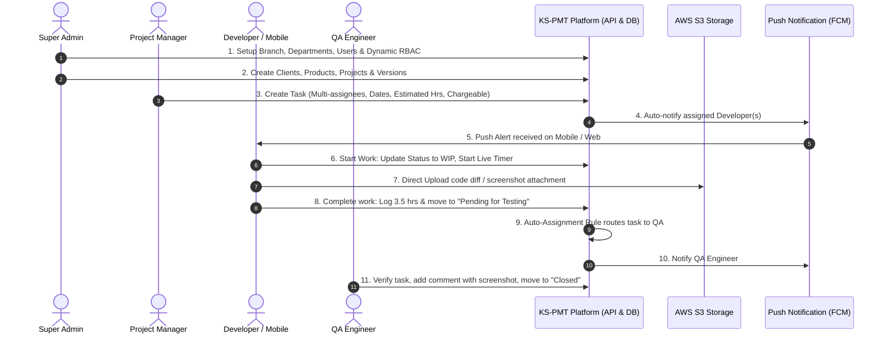

# System Walkthrough & Operational Guide
## KS-PMT: Multi-Branch Project & Product Management System

---

## 1. System Overview & Core User Flows

KS-PMT orchestrates software development and product management across multiple branches through an integrated web and mobile ecosystem. This walkthrough illustrates key operational workflows from initial configuration to daily task execution.



---

## 2. Step-by-Step User Journeys

### 2.1 Super Admin: Organizational & Security Setup

1. **Branch & Location Configuration**:
   - Navigate to **Settings > Branches**.
   - Create locations (e.g., *Head Office - Ahmedabad*, *Dev Center - Bengaluru*, *Regional Office - Mumbai*).
   - Enter geographic coordinates (Latitude, Longitude) and geofencing radius (e.g., 200 meters) used for mobile attendance or field visit verification.
2. **Departments & Designations**:
   - Define corporate departments: *Engineering*, *QA*, *DevOps*, *UI/UX*, *Support*, *Sales*.
   - Define designations with ranking levels (e.g., *Junior Developer (1)*, *Senior Developer (3)*, *Tech Lead (5)*, *Engineering Manager (7)*).
3. **User / Employee Provisioning**:
   - Navigate to **Users > Add Employee**. (No public registration exists; accounts are created by HR/Admin).
   - Input official email, mobile number, primary branch, department, designation, and reporting manager.
   - Choose login mode permissions (Password enabled, Mobile OTP enabled).
4. **Dynamic RBAC & Permission Overrides**:
   - Assign a base role (e.g., *Software Engineer*).
   - **Branch Override Example**: In *Branch B*, restrict financial amounts from being viewed even if the base role has read access.
   - **User Override Example**: Grant an individual senior developer explicit access to view client contract values without promoting them to Project Manager.

---

### 2.2 Product & Project Portfolio Setup

1. **Proprietary Products Setup**:
   - Navigate to **Products > Add Product**.
   - Enter details: Product Name (e.g., *KashCare Health ERP*), Code, Category, Production Version.
   - Setup commercial terms: Base License Fee, AMC percentage (e.g., 18% annually), Implementation charges.
   - Map existing clients who have purchased the product with their license type (SaaS / On-Premise) and AMC renewal dates.
2. **Custom Projects Setup**:
   - Navigate to **Projects > Add Project**.
   - Select Client (or convert an existing Prospect).
   - Select Branch and assign Project Manager.
   - Set Commercials: Contract Value (e.g., $45,000 USD), Billing Model (Fixed Cost or T&M hourly rate), Budgeted Hours (e.g., 600 hrs).
   - Allocate team members with start/end dates and allocation percentages.
3. **Version & Milestone Planning**:
   - Create Versions/Releases for Products or Projects (e.g., `v1.2.0 - Sprint 4`).
   - Define Target Release Date, Planned Start Date, and Release Notes.
   - Link tasks and bug fixes directly to this release cycle.

---

### 2.3 Dynamic Task Workflows & Auto-Assignment

1. **Configuring Dynamic Task Types**:
   - Go to **Settings > Task Types**.
   - Standard types available: `New Development`, `Bug`, `Issue`, `Enhancement`, `Training`, `Support Ticket`.
   - Configure workflow progression:
     - For `New Development`: `Open` -> `WIP` -> `Pending for Code Review` -> `Pending for Testing` -> `Testing` -> `Pending for Deployment` -> `Closed`.
     - For `Support Ticket`: `Open` -> `Under Investigation` -> `Client Feedback` -> `Resolved` -> `Closed`.
2. **Setting Up Auto-Assignment Rules**:
   - Rule 1 (On Creation): If Task Type = `Support Ticket`, auto-assign to designated Support Tier 1 engineer in the associated branch.
   - Rule 2 (On Status Transition): When any task moves to `Pending for Testing`, auto-reassign to the project's Lead QA Engineer.
   - Rule 3 (On Status Transition): When task moves to `Pending for Deployment`, auto-assign to the DevOps engineer.

---

### 2.4 Daily Workflow: Project Manager & Developers

1. **Task Creation**:
   - Open Project or Product workspace -> Click **New Task**.
   - Enter Title, Description, Priority (`High`), Task Type (`Bug`), Version (`v1.2.0`).
   - Assign to **multiple developers** (e.g., Lead Dev + Junior Dev).
   - Set Planned Start Date, Planned End Date, and Estimated Hours (e.g., 12.0 hrs).
   - Mark `is_chargeable = true` and specify Charge Amount (e.g., $600 USD) if this is an out-of-scope client request.
   - Break down into **Subtasks** (e.g., *1. Database Migration*, *2. API Endpoint*, *3. Unit Tests*).
2. **Developer Execution (Web & Mobile)**:
   - Developer logs in via **Email + Password** or **Mobile + OTP**.
   - Views personal dashboard with assigned tasks sorted by priority and due date.
   - Moves task status from `Open` to `WIP`.
   - Clicks **Start Timer** or manually logs work hours (e.g., 4.5 hrs billable) with a summary of accomplishments.
   - Adds comments and attaches error logs or screenshots. Files are securely uploaded directly to **AWS S3** via backend pre-signed URLs.
   - Upon completion, moves task to `Pending for Testing`.
3. **QA Verification**:
   - QA receives an immediate push notification and in-app alert.
   - Tests the build against task acceptance criteria.
   - If a defect is found: Adds comment with attached screen recording, and moves status to `Reopened`.
   - If verified: Moves status to `Verified / Closed`.

---

## 3. Mobile Application Walkthrough (Android & iOS)

### 3.1 Authentication & First Launch
- Launch mobile app -> Choose between **Email / Password** or **Mobile Number / OTP**.
- On Mobile OTP: Enter 10-digit number -> receive 6-digit SMS OTP -> auto-read / enter -> authenticated.
- Prompt for Camera, File Storage, Geolocation, and Push Notification permissions.

### 3.2 GPS Location Access & Branch Verification
- When an employee opens the app or logs a field visit / on-site task, the mobile app captures the current device GPS coordinates (Latitude & Longitude).
- The app checks proximity against the assigned office branch geofence radius.
- If within the geofence, the status displays **"Within Branch Location"**; for field engineers, the actual coordinates are tagged with the activity log.

### 3.3 Camera Capture & Direct AWS S3 Upload
1. Open any task -> Tap **"Add Attachment"**.
2. Options: **Take Photo (Camera)** or **Pick Document/Image (Gallery/Files)**.
3. Upon capture, the app compresses the image locally to optimize bandwidth.
4. The app requests a pre-signed PUT URL from the backend REST API: `POST /api/v1/attachments/presigned-upload-url`.
5. The mobile app uploads the binary payload directly to **AWS S3**.
6. The app confirms successful upload by calling the backend to register the attachment record with the task.

### 3.4 Push Notifications & Quick Actions
- Real-time push alerts via **Firebase Cloud Messaging (FCM)** for:
  - New task assignment.
  - Mention in a comment (`@employee`).
  - Critical bug raised in an assigned project.
- Tapping the notification deep-links directly to the Task Detail view.

---

## 4. REST API Integration Guide

### 4.1 Base URL & Security Headers
All external and client integrations interact with the versioned REST API.

- **Base URL**: `https://api.ks-pmt.kashvirainfotech.com/api/v1`
- **Required Headers**:
  ```http
  Authorization: Bearer <JWT_ACCESS_TOKEN>
  Content-Type: application/json
  Accept: application/json
  ```

### 4.2 Sample API Interactions

#### 1. Mobile OTP Authentication
```bash
# Step 1: Request OTP
curl -X POST https://api.ks-pmt.kashvirainfotech.com/api/v1/auth/request-otp \
  -H "Content-Type: application/json" \
  -d '{"mobile_number": "+919876543210"}'

# Step 2: Verify OTP and Obtain Tokens
curl -X POST https://api.ks-pmt.kashvirainfotech.com/api/v1/auth/login-otp \
  -H "Content-Type: application/json" \
  -d '{"mobile_number": "+919876543210", "otp": "482910"}'
```

#### 2. Create Task with Multi-Assignees & Chargeable Amount
```bash
curl -X POST https://api.ks-pmt.kashvirainfotech.com/api/v1/tasks \
  -H "Authorization: Bearer <TOKEN>" \
  -H "Content-Type: application/json" \
  -d '{
    "project_id": "9b1deb4d-3b7d-4bad-9bdd-2b0d7b3dcb6d",
    "version_id": "a5e8c142-83fc-4b5b-8012-32a8cb981e11",
    "task_type_id": "e4b2d184-7832-411a-8c77-47b8ef3a7210",
    "title": "Implement Stripe Payment Webhook Handling",
    "description": "Handle customer.subscription.updated and failed payment events.",
    "priority": "High",
    "planned_start_date": "2026-10-01T09:00:00Z",
    "planned_end_date": "2026-10-05T18:00:00Z",
    "estimated_hours": 16.0,
    "is_chargeable": true,
    "charge_amount": 800.00,
    "assignee_ids": [
      "c1a2b3c4-d5e6-7f8a-9b0c-1d2e3f4a5b6c",
      "f9e8d7c6-b5a4-3210-fedc-ba9876543210"
    ]
  }'
```

#### 3. Request AWS S3 Pre-signed Upload URL
```bash
curl -X POST https://api.ks-pmt.kashvirainfotech.com/api/v1/attachments/presigned-upload-url \
  -H "Authorization: Bearer <TOKEN>" \
  -H "Content-Type: application/json" \
  -d '{
    "entity_type": "TASK",
    "entity_id": "4a123bc4-56de-78fa-90bc-def123456789",
    "file_name": "bug_reproduction_screen.png",
    "mime_type": "image/png",
    "file_size": 245890
  }'
```
**Response**:
```json
{
  "success": true,
  "statusCode": 200,
  "data": {
    "attachment_id": "890fa123-bc45-67de-f890-bcdef1234567",
    "upload_url": "https://ks-pmt-attachments.s3.amazonaws.com/tasks/4a123bc4/bug_reproduction_screen.png?X-Amz-Algorithm=AWS4-HMAC-SHA256&...",
    "s3_key": "tasks/4a123bc4/bug_reproduction_screen.png",
    "expires_in_seconds": 900
  }
}
```

---

## 5. Audit & Activity Tracking Inspection

Every critical operation is logged automatically. Administrators can review the audit log via the web UI or API (`GET /api/v1/audit-logs`):

```json
{
  "id": "e3a8910b-1234-4567-890a-bcdef1234567",
  "entity_name": "tasks",
  "record_id": "4a123bc4-56de-78fa-90bc-def123456789",
  "action_type": "STATUS_UPDATE",
  "old_values": {
    "status": "WIP",
    "actual_end_date": null
  },
  "new_values": {
    "status": "Pending for Testing",
    "actual_end_date": "2026-10-04T17:30:00Z"
  },
  "performed_by": "c1a2b3c4-d5e6-7f8a-9b0c-1d2e3f4a5b6c",
  "ip_address": "122.179.84.12",
  "user_agent": "Mozilla/5.0 (Windows NT 10.0; Win64; x64) AppleWebKit/537.36",
  "location": "Ahmedabad, India",
  "created_at": "2026-10-04T17:30:15Z"
}
```
